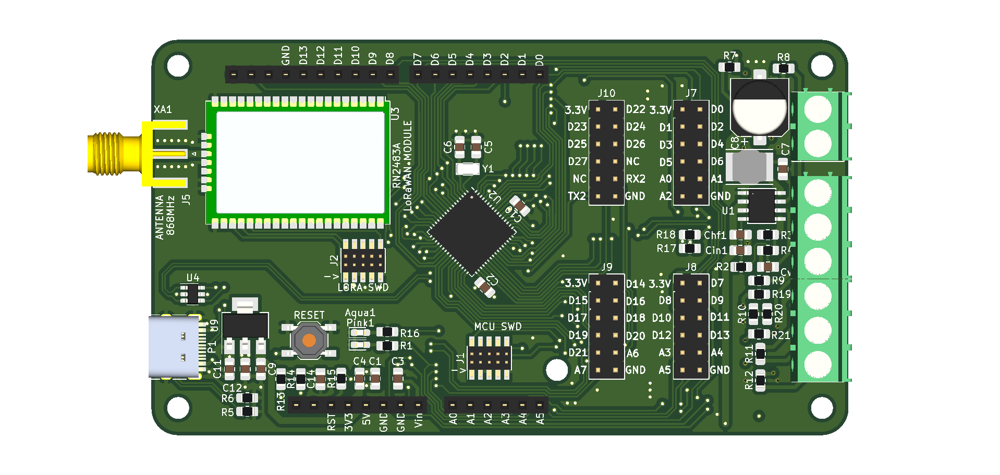
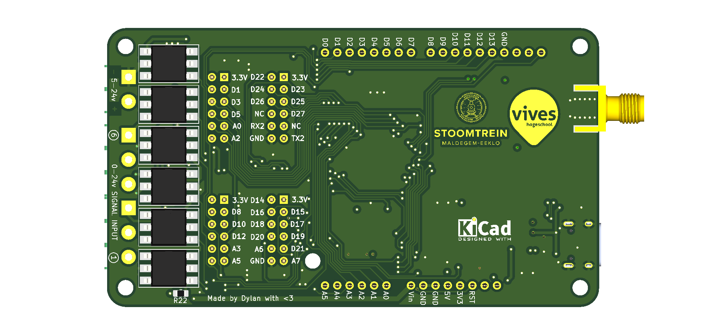

# LoRaWAN Logger ZERO+
| Front | Back |
|---|---|
| |  |

## Description
This board was made to help automate steam train management in an NPO. It is used to send status signals to a central server through LoRaWAN so the workers don’t have to go on site and check the states. There will also be an expansion board with relays to switch certain peripherals remotely.
It is equipped with 6 individual 24v tolerant isolated digital inputs. It can also be powered by 24v DC because it uses a buck converter to step the voltage down to 3.3v
Here are some other specifications:
* Microcontroller: ATSAMD21J18
* Flash: 256KB
* SRAM: 64KB
* Frequency: 48MHz
* ADC: 20-Channel 12bit
* DAC: Single-Channel 10bit 
* Pins: 52 GPIO pins

## This repository contains
* installation guide
* usage guide
* PCB and schematic files
* bootloader code and binaries
* ArduinoCore-samd libraries

## Installation
First open the configuration editor in Arduino under "File -> Preferences"
Then next to "Additional Boards Manager URLs" add the following url:
```
https://raw.githubusercontent.com/dylanmsu/ArduinoCore-samd/master/Workshop11Core-samd/package_workshop11_index.json
```

For a more detailed explanation, refer to [this guide](https://support.arduino.cc/hc/en-us/articles/360016119519-How-to-add-boards-in-the-board-manager).

## Usage
TODO

## Schematic
TODO
